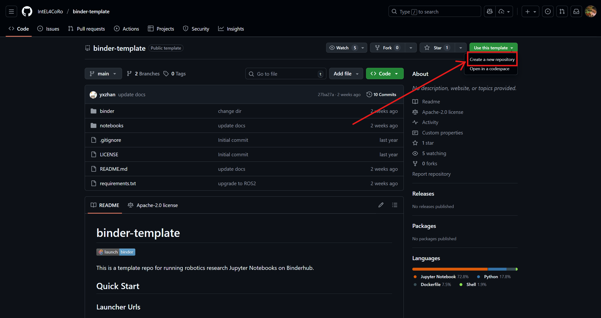
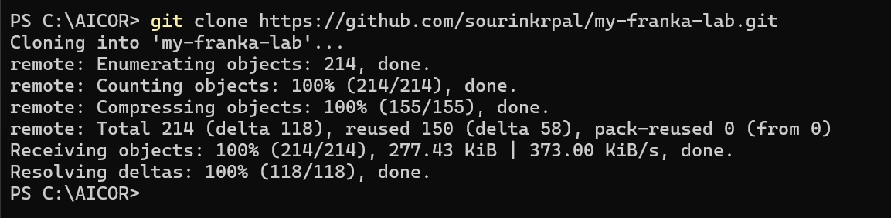
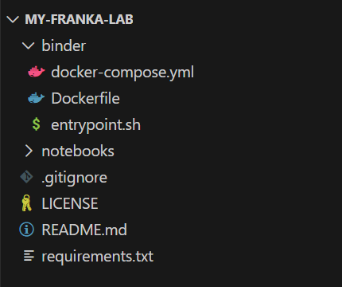
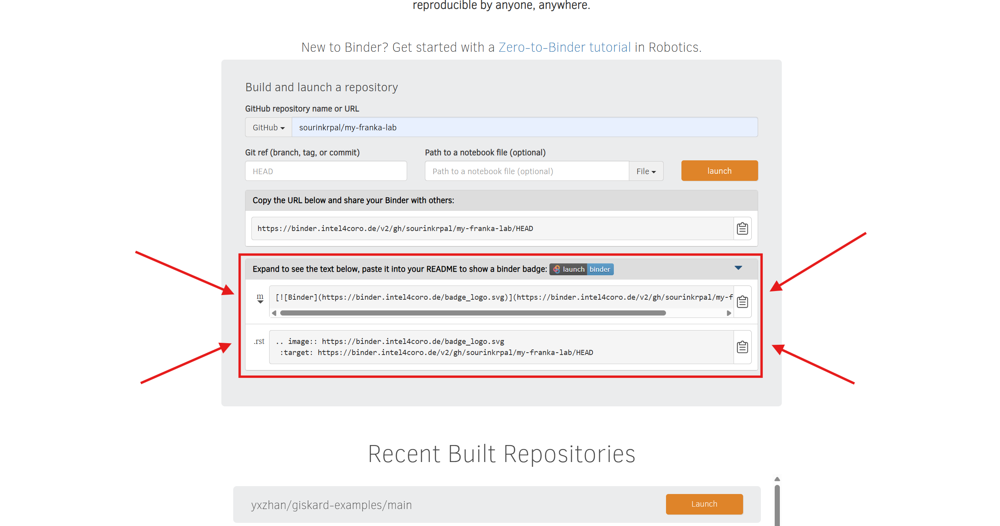
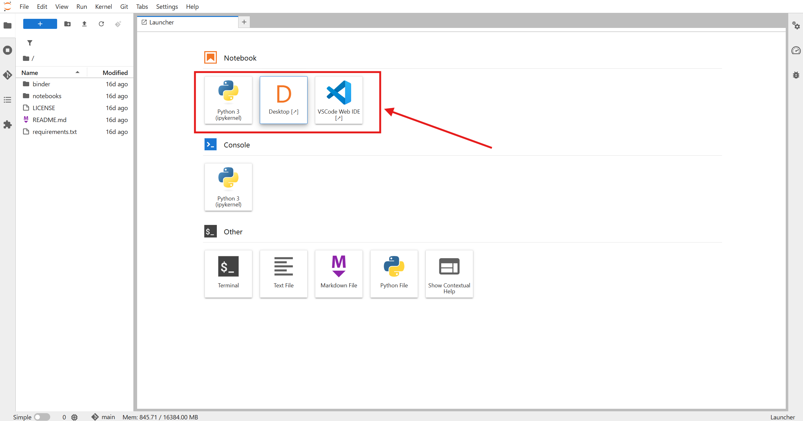

# Creating Your First Lab
### Draft by Sourin Kumar Pal

The **Virtual Research Building (VRB)** is a cloud-based platform for running reproducible robotic experiments inside browser-based virtual labs.

This tutorial explains:
- what a virtual lab is,
- how to add your own robot model,
- how to visualize the robot inside the lab, and
- how to integrate your preferred programming tools (or the VRB’s tools) to control it.

---

## Table of Contents

- [1. What is a Virtual Lab?](#1-what-is-a-virtual-lab)
  - [1.1 Brief Overview](#11-brief-overview)
  - [1.2 Technical Overview](#12-technical-overview)

- [2. What’s in the Box?](#2-whats-in-the-box)
  - [2.1 Preinstalled Tools](#21-preinstalled-tools)
  - [2.2 Installing More Software](#22-installing-more-software)
  - [2.3 Example: Installing a Python Package](#23-example-installing-a-python-package)

- [3. How to Set Up Docker + Git to Create Your Lab](#3-how-to-set-up-docker--git-to-create-your-lab)
  - [3.1 Accessing the Base Lab Template](#31-accessing-the-base-lab-template)
  - [3.2 Cloning the Repository](#32-cloning-the-repository)
  - [3.3 Editing the Contents of Your Lab](#33-editing-the-contents-of-your-lab)
  - [3.4 Install Additional Software (Dockerfile)](#34-install-additional-software-dockerfile)
  - [3.5 Launching the Lab with Binder](#35-launching-the-lab-with-binder)
  - [3.6 What You See When Binder Starts](#36-what-you-see-when-binder-starts)
  - [3.7 Checklist of Typical Edits](#37-checklist-of-typical-edits)

---

## 1. What is a Virtual Lab?

### 1.1 Brief Overview

A **virtual lab** is a version-controlled, self-contained robotics workspace packaged as a **Docker container**.  
It includes all components required for an experiment:

- robot model  
- environment model  
- simulation or control software  
- your code and data  
- any additional libraries you install  

Because the entire lab exists inside a portable Docker image and is connected to Git, anyone can launch it in the exact same state that allows repeatable, shareable robotics experiments.

---

### 1.2 Technical Overview

A VRB lab runs through a set of virtualization and web technologies that work together:

- **Docker** provides an isolated environment with all your dependencies and robot models.  
- **Git** tracks your lab’s content and connects it to cloud execution services.  
- **Binder** builds and launches your Docker image directly in the browser.  
- **JupyterLab** offers a browser-based development environment for editing and running code.  
- **VNC** gives you access to a full desktop session in the browser, for example to run GUIs such as simulators.

Together, these systems allow you to edit, run, visualize, and share robotics experiments entirely online, without installing any robotics toolchain locally.

<p align="center">
  
  <br>
  <em>Architectural Flow</em>
</p>

<p align="center">
  
  &nbsp;&nbsp;&nbsp;
  
  <br>
  <em>Binder Split View (left) | VNC Desktop (right)</em>
</p>

---

## 2. What’s in the Box?

The VRB base image already includes a few core tools so you can start working right away.

### 2.1 Preinstalled Tools

- **ROS**  
  The standard middleware used in robotics for communication and running robot software.

- **JupyterLab**  
  The main web interface you see in the browser. You can browse files, open terminals, and run notebooks here.

- **VSCode Server**  
  A browser-based version of Visual Studio Code. It lets you edit your lab with a full IDE without installing anything locally.

- **VNC Desktop**  
  A virtual Linux desktop environment inside the browser. Useful for running GUI tools, simulators, and robot viewers.

---

### 2.2 Installing More Software

If you need extra libraries or tools, you can simply add them to the lab’s `Dockerfile`.  
When Binder rebuilds your lab, those tools will be included automatically.

Typical things you can add:
- Physics engines (MuJoCo, Bullet etc.)
- Scene/robot management libraries (Multiverse)
- Perception frameworks (RoboKudo)
- Robot control frameworks (PyCRAM, MoveIt)
- Full ROS 2 distributions
- Data science libraries (NumPy, PyTorch, TensorFlow)

---

### 2.3 Example: Installing a Python Package

Below is a minimal example showing how to install `numpy` inside your lab's Dockerfile:

```Dockerfile
# Install Python packages
RUN pip install numpy
```

When you commit and push the updated Dockerfile, Binder will rebuild the lab with `numpy` included.

## 3. How to Set Up Docker + Git to Create Your Lab

To create your own VRB lab, you start by copying the base lab template, connecting it to Git, and then editing the files inside it.  
This section walks you through the basic workflow.

---

### 3.1 Accessing the Base Lab Template

Every VRB lab is created from a template repository.  
This template already contains:

- a Dockerfile  
- the required Binder configuration  
- the startup scripts for JupyterLab and VNC  

To get started:

1. Open the base template repository in your browser.
  You can access the Base Binder Template here: **[IntEL4CoRo/binder-template](https://github.com/IntEL4CoRo/binder-template)**

    <p align="center">
      
      <br>
      <em>Base template repository</em>
    </p>

2. Click **“Use this template”** to make your own copy.  
3. Choose a name for your new lab and create the repository (usually public, so Binder can access it).

Your new Git repository now contains the full lab structure.

---

### 3.2 Cloning the Repository

Next, download the repository to your computer:

```bash
git clone https://github.com/<YOUR-USERNAME>/<YOUR-LAB>.git
cd <YOUR-LAB>
```

<p align="center">
  
  <br>
  <em>Example of cloning the repository</em>
</p>

Inside the folder, you will see files such as:

- `Dockerfile` or `binder/Dockerfile`  
- `notebooks/`  
- `models/` (you can create this folder if needed)

<p align="center">
  
  <br>
  <em>Opening the repo in VSCode</em>
</p>

These files make up the structure of your virtual lab.

---
### 3.3 Editing the Contents of Your Lab

Once the repository is cloned, you can start customizing the lab:

**Add your own files**  
- Place robot models (URDF, MJCF, meshes) in a folder such as `models/`.  
- Add Python scripts or simulation code to `scripts/`.  
- Create or edit Jupyter notebooks in `notebooks/`.
- All changes must be committed and pushed:

```bash
git add .
git commit -m "Update files in the lab"
git push
````
---
### 3.4 Install additional software (Dockerfile).

To add Python or system packages, edit the Dockerfile.
Example: Installing PyBullet, Panda-Gym, Gymnasium, and the system libraries needed for rendering:

```Dockerfile
# Install Python simulation libraries (PyBullet + Panda-Gym)
RUN pip install --no-cache-dir pybullet panda-gym[pybullet] gymnasium

# Install system dependencies required by PyBullet for rendering
USER root
RUN apt update && apt install -y --no-install-recommends \
        libosmesa6 libosmesa6-dev libgl1 mesa-utils \
        libglew-dev libglfw3 libglfw3-dev patchelf && \
    rm -rf /var/lib/apt/lists/*

USER $NB_USER
```

After editing the Dockerfile or adding files, remember to save your changes in Git:

```bash
git add .
git commit -m "Install PyBullet and add custom files"
git push
```
Your updated Dockerfile will be used the next time Binder launches your lab.

---

### 3.5 Launching the Lab with Binder

Binder builds your Docker image and starts the lab directly in the browser.

To launch your lab:

1.  You can access the BinderHub here:  
**[binder.intel4coro.de](https://binder.intel4coro.de)**
2. Paste your repository name (For example: sourinkrpal/my-franka-lab)
3. Copy the auto-generated launch URL and open it in a new tab.

<p align="center">
  
  <br>
  <em>Binder Launch Page</em>
</p>

4.  Binder will:
    
    -   read your repository
    -   build the Docker image from your Dockerfile
    -   start the lab in an online session
        
The first build may take several minutes. Later launches are faster because Binder reuses the cached image.

<p align="center">
  
  <br>
  <em>Binder Loading / Building Docker Image</em>
</p>

You can also add a Binder badge to your `README.md` so anyone can launch your lab with one click:

<p align="center">
  
  <br>
  <em>Badge Link</em>
</p>

----------

### 3.6 What You See When Binder Starts

When Binder finishes building and opens your lab, you will usually see two interfaces:

-   **JupyterLab**  
    This is the main browser-based workspace where you can open notebooks, browse files, create terminals, and edit code.
    
-   **VNC Desktop**  
    A virtual Linux desktop accessible through the browser.  
    This is useful for running graphical applications such as robot simulators, PyBullet viewers, MuJoCo GUIs, or custom tools.

<p align="center">
  
  <br>
  <em>After Binder Launch (JupyterLab + VNC)</em>
</p>

From here, you can:

-   run Python scripts,
-   open your simulator in the VNC window,
-   test your robot model,
-   and continue editing the lab structure.

### 3.7 Checklist of Typical Edits

-   Add robot model files
-   Add or update Python scripts
-   Add or modify notebooks
-   Install new packages via Dockerfile
-   Commit and push changes
-   Rebuild through Binder


---


