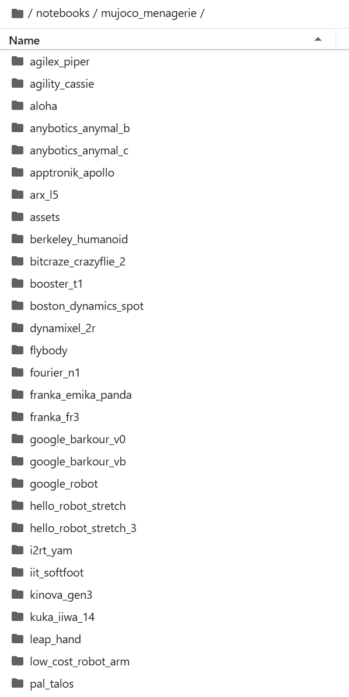
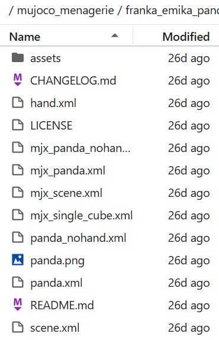
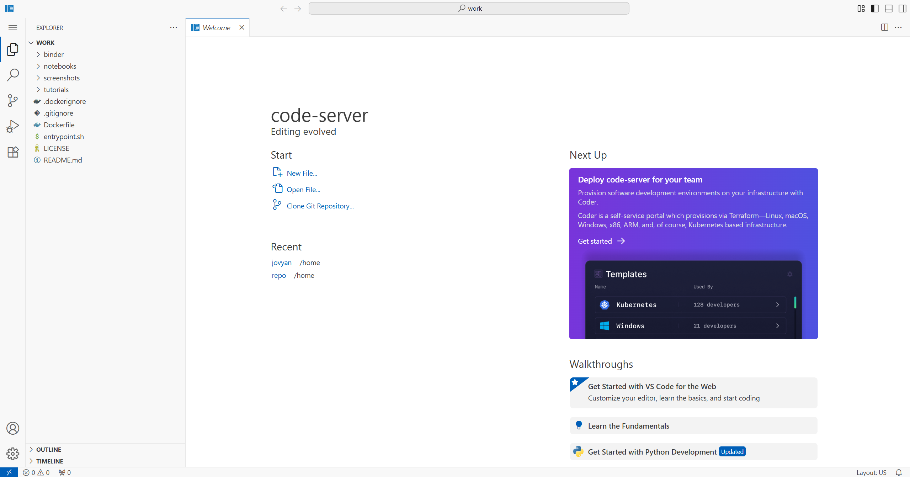

# Creating Your First Lab
### Draft by Sourin Kumar Pal

The **Virtual Research Building (VRB)** is a cloud-based platform for running reproducible robotic experiments inside browser-based virtual labs.

This tutorial explains:
- what a virtual lab is,
- how to add your own robot model,
- how to visualize the robot inside the lab, and
- how to integrate your preferred programming tools (or the VRB’s tools) to control it.

---

## Table of Contents

- [1. What is a Virtual Lab?](#1-what-is-a-virtual-lab)
  - [1.1 Brief Overview](#11-brief-overview)
  - [1.2 Technical Overview](#12-technical-overview)

- [2. What’s in the Box?](#2-whats-in-the-box)
  - [2.1 Preinstalled Tools](#21-preinstalled-tools)
  - [2.2 Installing More Software](#22-installing-more-software)
  - [2.3 Example: Installing a Python Package](#23-example-installing-a-python-package)

- [3. How to Set Up Docker + Git to Create Your Lab](#3-how-to-set-up-docker--git-to-create-your-lab)
  - [3.1 Accessing the Base Lab Template](#31-accessing-the-base-lab-template)
  - [3.2 Cloning the Repository](#32-cloning-the-repository)
  - [3.3 Editing the Contents of Your Lab](#33-editing-the-contents-of-your-lab)
  - [3.4 Install Additional Software (Dockerfile)](#34-install-additional-software-dockerfile)
  - [3.5 Launching the Lab with Binder](#35-launching-the-lab-with-binder)
  - [3.6 What You See When Binder Starts](#36-what-you-see-when-binder-starts)

- [4. Adding a Robot Model](#4-adding-a-robot-model)
  - [4.1 Getting the Robot Model (MuJoCo Menagerie)](#41-getting-the-robot-model-mujoco-menagerie)
  - [4.2 Scripts and Notebooks](#42-scripts-and-notebooks)
    - [4.2.1 The `scripts/` Folder](#421-the-scripts-folder)
    - [4.2.2 The `notebooks/` Folder](#422-the-notebooks-folder)
    - [4.2.3 How Scripts and Notebooks Work Together](#423-how-scripts-and-notebooks-work-together)
    - [4.2.4 Why This Structure Is Recommended](#424-why-this-structure-is-recommended)

- [5. Controlling the Simulation from JupyterLab (Simple UI Example)](#5-controlling-the-simulation-from-jupyterlab-simple-ui-example)
  - [5.1 Creating a Button in a Jupyter Notebook](#51-creating-a-button-in-a-jupyter-notebook)
  - [5.2 Connecting the Button to a Python Function](#52-connecting-the-button-to-a-python-function)

- [VSCode Remote Development (Optional)](#vscode-remote-development-optional)
  - [Opening VSCode](#opening-vscode)

- [6. Common Troubleshooting](#6-common-troubleshooting)

---

## 1. What is a Virtual Lab?

### 1.1 Brief Overview

A **virtual lab** is a version-controlled, self-contained robotics workspace packaged as a **Docker container**.  
It includes all components required for an experiment:

- robot model  
- environment model  
- simulation or control software  
- your code and data  
- any additional libraries you install  

Because the entire lab exists inside a portable Docker image and is connected to Git, anyone can launch it in the exact same state that allows repeatable, shareable robotics experiments.

---

### 1.2 Technical Overview

A VRB lab runs through a set of virtualization and web technologies that work together:

- **Docker** provides an isolated environment with all your dependencies and robot models.  
- **Git** tracks your lab’s content and connects it to cloud execution services.  
- **Binder** builds and launches your Docker image directly in the browser.  
- **JupyterLab** offers a browser-based development environment for editing and running code.  
- **VNC** gives you access to a full desktop session in the browser, for example to run GUIs such as simulators.

Together, these systems allow you to edit, run, visualize, and share robotics experiments entirely online, without installing any robotics toolchain locally.

<p align="center">
  
  <br>
  <em>Architectural Flow</em>
</p>

<p align="center">
  
  &nbsp;&nbsp;&nbsp;
  
  <br>
  <em>Binder Split View (left) | VNC Desktop (right)</em>
</p>

---

## 2. What’s in the Box?

The VRB uses a shared **base Docker image**, which provides a minimal environment for running a lab.  
You can view or clone the base image template here:  
👉 **[VRB Base Image](https://github.com/IntEL4CoRo/binder-template)**

This base image already includes a few core tools so you can start working immediately.

### 2.1 Preinstalled Tools

- **ROS**  
  The standard middleware used in robotics for communication and running robot software.

- **JupyterLab**  
  The main web interface you see in the browser. You can browse files, open terminals, and run notebooks here.

- **VSCode Server**  
  A browser-based version of Visual Studio Code. It lets you edit your lab with a full IDE without installing anything locally.

- **VNC Desktop**  
  A virtual Linux desktop environment inside the browser. Useful for running GUI tools, simulators, and robot viewers.

---

### 2.2 Installing More Software

You can install **any software you want** into your lab by modifying the `Dockerfile`. Feel free to use whatever tools your project requires.
When Binder rebuilds your lab, those tools will be included automatically.

Typical things you can add:
- Physics engines (e.g., MuJoCo, Bullet etc.)
- Scene/robot management libraries (e.g., Multiverse)
- Perception frameworks (e.g., RoboKudo)
- Robot control frameworks (e.g., PyCRAM, MoveIt)
- Full ROS 2 distributions
- Data science libraries (e.g., NumPy, PyTorch, TensorFlow)

---

### 2.3 Example: Installing a Python Package

Below is a minimal example s  howing how to install `numpy` inside your lab's Dockerfile:

```Dockerfile
# Install Python packages
RUN pip install numpy
```

When you commit and push the updated Dockerfile, Binder will rebuild the lab with `numpy` included.

## 3. How to Set Up Docker + Git to Create Your Lab

To create your own VRB lab, you start by copying the base lab template, connecting it to Git, and then editing the files inside it.  
This section walks you through the basic workflow.

---

### 3.1 Accessing the Base Lab Template

Every VRB lab is created from a template repository.  
This template already contains:

- a Dockerfile  
- the required Binder configuration  
- the startup scripts for JupyterLab and VNC  

To get started:

1. Open the base template repository in your browser.
  You can access the Base Binder Template here: **[IntEL4CoRo/binder-template](https://github.com/IntEL4CoRo/binder-template)**

    <p align="center">
      
      <br>
      <em>Base template repository</em>
    </p>

2. Click **“Use this template”** to make your own copy.  
3. Choose a name for your new lab and create the repository (usually public, so Binder can access it).

Your new Git repository now contains the full lab structure.

---

### 3.2 Cloning the Repository

Next, download the repository to your computer:

```bash
git clone https://github.com/<YOUR-USERNAME>/<YOUR-LAB>.git
cd <YOUR-LAB>
```

<p align="center">
  
  <br>
  <em>Example of cloning the repository</em>
</p>

Inside the folder, you will see files such as:

- `Dockerfile` or `binder/Dockerfile`  
- `notebooks/`  
- `models/` (you can create this folder if needed)

<p align="center">
  
  <br>
  <em>Opening the repo in VSCode</em>
</p>

These files make up the structure of your virtual lab.

---
### 3.3 Editing the Contents of Your Lab

Once the repository is cloned, you can start customizing the lab:

**Add your own files**  
- Place robot models (URDF, MJCF, meshes) in a folder such as `models/`.  
- Add Python scripts or simulation code to `scripts/`.  
- Create or edit Jupyter notebooks in `notebooks/`.
- All changes must be committed and pushed:

```bash
git add .
git commit -m "Update files in the lab"
git push
````
---
### 3.4 Install additional software (Dockerfile).

To add Python or system packages, edit the Dockerfile.
Example: Installing PyBullet, Panda-Gym, Gymnasium, and the system libraries needed for rendering:

```Dockerfile
# Install Python simulation libraries (PyBullet + Panda-Gym)
RUN pip install --no-cache-dir pybullet panda-gym[pybullet] gymnasium

# Install system dependencies required by PyBullet for rendering
USER root
RUN apt update && apt install -y --no-install-recommends \
        libosmesa6 libosmesa6-dev libgl1 mesa-utils \
        libglew-dev libglfw3 libglfw3-dev patchelf && \
    rm -rf /var/lib/apt/lists/*

USER $NB_USER
```

After editing the Dockerfile or adding files, remember to save your changes in Git:

```bash
git add .
git commit -m "Install PyBullet and add custom files"
git push
```
Your updated Dockerfile will be used the next time Binder launches your lab.

---

### 3.5 Launching the Lab with Binder

Binder builds your Docker image and starts the lab directly in the browser.

To launch your lab:

1.  You can access the BinderHub here:  
**[binder.intel4coro.de](https://binder.intel4coro.de)**
2. Paste your repository name (For example: sourinkrpal/my-franka-lab)
3. Copy the auto-generated launch URL and open it in a new tab.

<p align="center">
  
  <br>
  <em>Binder Launch Page</em>
</p>

4.  Binder will:
    
    -   read your repository
    -   build the Docker image from your Dockerfile
    -   start the lab in an online session
        
The first build may take several minutes. Later launches are faster because Binder reuses the cached image.

<p align="center">
  
  <br>
  <em>Binder Loading / Building Docker Image</em>
</p>

You can also add a Binder badge to your `README.md` so anyone can launch your lab with one click:

<p align="center">
  
  <br>
  <em>Badge Link</em>
</p>

----------

### 3.6 What You See When Binder Starts

When Binder finishes building and opens your lab, you will usually see two interfaces:

-   **JupyterLab**  
    This is the main browser-based workspace where you can open notebooks, browse files, create terminals, and edit code.
    
-   **VNC Desktop**  
    A virtual Linux desktop accessible through the browser.  
    This is useful for running graphical applications such as robot simulators, PyBullet viewers, MuJoCo GUIs, or custom tools.

<p align="center">
  
  <br>
  <em>After Binder Launch (JupyterLab + VNC)</em>
</p>

From here, you can:

-   run Python scripts,
-   open your simulator in the VNC window,
-   test your robot model,
-   and continue editing the lab structure.

## 4. Adding a Robot Model

This section shows **one of the possible ways** to add and visualize a robot inside a VRB lab, using **MuJoCo** as an example. **MuJoCo is not required** to use the VRB.

You are free to use **any simulator, framework, or workflow** that fits your project, such as other physics engines, ROS-based setups, or custom viewers.  
The VRB merely provides infrastructure for hosting and interacting with virtual robot labs. This example demonstrates the general idea of integrating a robot into a lab.

### 4.1 Getting the Robot Model (MuJoCo Menagerie)

MuJoCo provides a collection of ready-to-use robot models through the **MuJoCo Menagerie** repository.

To make these models available inside the lab, the repository is cloned during image build time by adding the following line to the `Dockerfile`:

```Dockerfile
RUN git clone --depth 1 https://github.com/google-deepmind/mujoco_menagerie.git \
    ${HOME}/work/notebooks/mujoco_menagerie || true
```
When Binder builds the lab image, the repository is cloned automatically.

After the build, the `mujoco_menagerie` repository is available inside the lab.
It contains **many different robot models**, each stored in its own subfolder.

<p align="center">
  
  <br>
  <em>MuJoCo Menagerie repository inside the lab, showing multiple robot models</em>
</p>

For this example, we focus on the **Franka Emika Panda** robot.
Opening the `franka_emika_panda` folder shows the files used to define the robot and its simulation scene:

<p align="center">
  
  <br>
  <em>Contents of the franka_emika_panda folder</em>
</p>

In this example, the `scene.xml` file is used to load the robot and its environment in MuJoCo.

### 4.2 Scripts and Notebooks

In this lab, the code is structured so that **simulation logic** and **user interaction** are clearly separated.  
This makes the example easier to understand, reuse, and extend.

### 4.2.1 The `scripts/` Folder

The `scripts/` folder contains **pure Python code** that implements the simulation logic.

For this example, the main file is [scripts/franka_mujoco_demo.py](https://github.com/sourinkrpal/my-franka-lab/blob/main/notebooks/scripts/franka_mujoco_demo.py).


This script is responsible for:

- loading the Franka Panda model from the MuJoCo Menagerie,
- starting the MuJoCo viewer inside the VNC desktop,
- stepping the simulation,
- applying simple control commands,
- exposing a public function (`start_demo`) that can be called from a notebook.

Keeping this logic inside `scripts/` has two advantages:

- the simulation code can be reused in multiple notebooks,
- the notebook stays clean and focused on interaction, not implementation details.


### 4.2.2 The `notebooks/` Folder

The `notebooks/` folder contains **Jupyter notebooks** that users interact with directly.

For this example, a dedicated notebook is used: [notebooks/franka_demo.ipynb](https://github.com/sourinkrpal/my-franka-lab/blob/main/notebooks/my_franka.ipynb).

The notebook acts as a **control interface**. It does not contain simulation logic itself.  
Instead, it:

1. Ensures that the VNC desktop is running.
2. Imports the simulation code from the `scripts/` folder.
3. Launches the interactive demo (Start / Stop buttons).

This separation keeps the notebook easy to read and suitable for beginners.


### 4.2.3 How Scripts and Notebooks Work Together

The interaction flow is as follows:

1. The user opens the notebook in JupyterLab.
2. The notebook starts the VNC desktop.
3. The notebook imports and calls `start_demo()` from the script.
4. The script launches the MuJoCo viewer in the VNC desktop.
5. The user controls the simulation using buttons in JupyterLab.

This pattern can be reused for other robots, simulators, or frameworks, and enables users to interact with your lab via JupyterLab.


### 4.2.4 Why This Structure Is Recommended

This structure is **not mandatory**, but it is recommended because it:

- keeps notebooks simple and readable,
- avoids duplicated code,
- makes simulations easier to maintain,
- allows scripts to be reused outside of Jupyter if needed.

You are free to organize your lab differently if your project requires it.

## 5. Controlling the Simulation from JupyterLab (Simple UI Example)

This section demonstrates a **minimal user interface example** using a Jupyter Notebook.  
The goal is to show how a simple button can be used to trigger Python code that controls a robot simulation running inside the VNC desktop.

This is only one possible approach. You are free to use other interaction methods or build more complex interfaces if needed.

---

### 5.1 Creating a Button in a Jupyter Notebook

Jupyter provides basic UI elements through the `ipywidgets` library.  
In this example, two buttons are created:

- **Start Simulation**
- **Stop Simulation**

These buttons are defined in Python and displayed directly inside the notebook.

The buttons themselves do not contain simulation logic; they only act as triggers for Python functions.

---

### 5.2 Connecting the Button to a Python Function

Each button is connected to a Python callback function using the `on_click` mechanism:

```python
start_button.on_click(lambda b: start_clicked(b, out))
stop_button.on_click(lambda b: stop_clicked(b, out))
```
When a button is clicked, the corresponding function is executed.
This allows user interaction in the notebook to directly trigger Python code.

<p align="center">
  
  <br>
  <em>Start/Stop Button</em>
</p>

When the **Start Simulation** button is clicked, the callback function:

* launches or reloads the robot simulation,
* opens the simulation viewer inside the VNC desktop,
* starts the simulation loop.

When the **Stop Simulation** button is clicked:

* the simulation loop is stopped,
* the viewer exits cleanly.

All simulation logic is implemented in the `scripts/` folder.
The notebook acts only as a lightweight control interface.

<p align="center">
  
  <br>
  <em>Franka Emika Panda Simulation</em>
</p>

## VSCode Remote Development (Optional)

VRB labs can be accessed using a **browser-based version of Visual Studio Code**.  
This is optional and works alongside JupyterLab.

---

### Opening VSCode

By default, a lab opens in **JupyterLab**.

To open **VSCode directly**, add the following parameter to the Binder URL:
```
?urlpath=vscode?folder=/home/jovyan
```

**Example:**

https://binder.intel4coro.de/v2/gh/sourinkrpal/my-franka-lab/main?urlpath=vscode?folder=/home/jovyan/work

<p align="center">
  
  <br>
  <em>VS Code Interface</em>
</p>

## 6. Common Troubleshooting

| Problem | Cause | Fix |
|-------|------|-----|
| Binder build takes a long time or fails | The Docker image is large or being built for the first time | Wait for the build to finish. Check the Binder build logs for errors if it fails. |
| Changes do not appear after editing files | Changes were not committed and pushed to Git | Run `git add .`, `git commit -m "Update lab files"`, and `git push`, then relaunch the Binder session. |
| VNC desktop does not appear | The VNC service was not started | Run the notebook cell that starts the desktop (e.g. `display_desktop()`), or reload the Binder session. |
| Simulation does not start when clicking the button | The simulation thread is already running or stuck | Click **Stop Simulation** first, or restart the notebook kernel and rerun the cells. |
| MuJoCo viewer opens but shows nothing | Incorrect model path or missing XML file | Check that the robot files exist and that `scene.xml` is referenced with the correct path. |
| Jupyter kernel becomes unresponsive | The simulation loop is blocking the main thread | Ensure the simulation runs in a separate thread. Restart the kernel if needed. |
| Git push is rejected | Remote repository contains newer changes | Run `git pull`, resolve any conflicts, then push again. |

**Tip:** If something behaves unexpectedly, restarting the kernel and relaunching the Binder session resolves most issues.